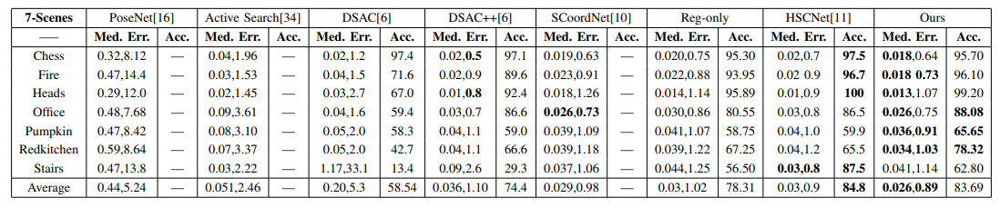
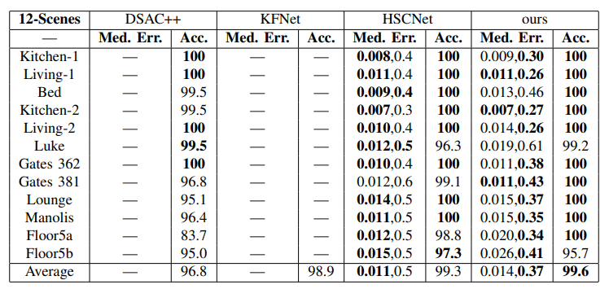

# A Deep Feature Aggregation Network for Accurate Indoor Camera Localization
This is the PyTorch implementation of our paper "A Deep Feature Aggregation Network for Accurate Indoor Camera Localization".

# Installation 
* To run our model, set up python3 environment from requirement.txt::
```
pip3 install -r requirement.txt 
```

* To compute pose by RANSAC-based PnP algorithm, you will need to build the cython module:
``` 
cd ./pnpransac
rm -rf build
python setup.py build_ext --inplace
```

# Datasets
* 7-Scenes: Download the dataset from the [website](https://www.microsoft.com/en-us/research/project/rgb-d-dataset-7-scenes/).
* 12-Scenes: Download the dataset from the [website](https://graphics.stanford.edu/projects/reloc/).
* our actual environment:Besides experiments on open-source datasets, one actual environment is implemented to verify the effectiveness of the
  proposed method. The dataset, which includes three training sequences and one testing sequence, is recorded from a hand-held Kinect RGB-D camera. We use an implementation of    the KinectFusion system to obtain the ground truth poses. 

# Training and evaluating
* Training on 7-Scenes dataset:
```
CUDA_VISIBLE_DEVICES=gpu_id python main.py --model fdanet --dataset 7S --scene chess --data_path ./data/ --flag train 
```
* training on 12-Scenes dataset:
```
CUDA_VISIBLE_DEVICES=gpu_id python main.py --model fdanet --dataset 12S --scene office2/5b --data_path ./data/ --flag train 
```
* evaluating on 7-Scenes dataset:
```
CUDA_VISIBLE_DEVICES=gpu_id python main.py --model fdanet --dataset 7S --scene chess --data_path ./data/ --flag test --resume model_path
```
* evaluating on 12-Scenes dataset:
```

CUDA_VISIBLE_DEVICES=gpu_id python main.py --model fdanet --dataset 12S --scene office2/5b --data_path ./data/ --flag test --resume model_path 
```

Examples:
```
CUDA_VISIBLE_DEVICES=1 python main.py --model fdanet --dataset 7S --scene chess --data_path ./data/ --flag test --resume /mnt/sda2/xt/7scenes/lap/chess_supervise_PFFM.pth
```

# Pretrained Model. 
We provide our pre-trained models on 7-Scenes [link](https://1drv.ms/u/s!AhkpUA6woaoPqAy1QJBCWXACXK1B?e=DRXaj9) and on 12-Scenes [link](https://1drv.ms/u/s!AhkpUA6woaoPqA7s2laIRZK047I-?e=ch3DIv). Download them and move them to their according folders. For example, move the chess_supervise_PFFM.pth to train_log/7-Scenes/. Then revise --resume train_log/7-Scenes/chess_supervise_PFFM.pth. 


# Results
* Evaluation result on 7-Scenes dataset:

  

* Evaluation result on 12-Scenes dataset:

  
